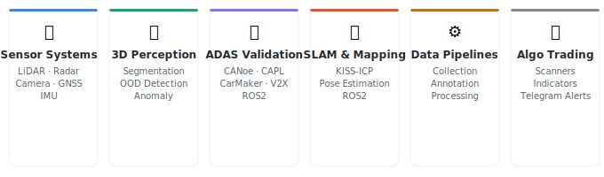

<!-- ═══════════════════════════════════════════════════════════════════ -->
<!--              SOURABH LOLGE — GitHub Profile README               -->
<!--         Upload Sourabh_Lolge_Photo.jpeg to this repo root        -->
<!-- ═══════════════════════════════════════════════════════════════════ -->

<!-- HEADER BANNER — Option 2: photo left, name+title right -->
<table>
  <tr>
    <td valign="middle" style="padding-left: 20px;">
      <h2>Sourabh Lolge</h2>
      

        <strong>Computer Vision & Autonomous Driving Engineer</strong> 
        M.Eng. · Technische Hochschule Ingolstadt, Germany
      

      

        
        &nbsp;
        
      

      

        
        &nbsp;
        
        &nbsp;
        
      

    </td>
  </tr>
</table>

---

## About Me

ADAS and perception engineer with 3+ years building autonomous driving
systems — from raw sensor data to deployed functions on real vehicles.

I commission and integrate sensor setups (LiDAR, radar, camera, GNSS,
IMU), build C++ and Python processing pipelines, run data collection
campaigns with instrumented test vehicles, and train deep learning models
for 3D scene understanding. On the validation side I work with CANoe,
CAPL, V2X stacks, and scenario-based testing in IPG CarMaker and ROS2.

My master's thesis is on 3D LiDAR anomaly detection — teaching vehicles
to recognize objects they've never seen before. Outside of that I build
stock market scanners that push technical indicator alerts to Telegram
because why not automate everything.

When I'm not in front of a screen: volleyball, table tennis, and portrait
sketching. The kind of person who finds sensor calibration and candlestick
patterns equally satisfying.

📍 Ingolstadt, Germany · Open to Munich, Stuttgart & surrounding region
🌐 German B2 · English C1

## What I work on

## 🔬 Featured Project

<table>
  <tr>
    <td width="65%">
      <h3>
        <a href="https://github.com/SKLols/stu-anomaly-postprocessing">
          Query-Optimized 3D Anomaly Segmentation
        </a>
      </h3>
      

        Extended the CVPR 2025 STU benchmark with a novel post-processing
        query selection framework and the first comprehensive evaluation of
        all major uncertainty methods in 3D LiDAR anomaly detection for
        autonomous driving. No architectural changes — pure post-processing.
      

      

        
        
        
        
      

    </td>
    <td width="35%" align="center">
        
        
      
    </td>
  </tr>
</table>

---

## 🗂 Projects

| Project | Description | Stack |
|---------|-------------|-------|
| [stu-anomaly-postprocessing](https://github.com/SKLols/stu-anomaly-postprocessing) | 3D LiDAR anomaly segmentation extending CVPR 2025 STU benchmark. Novel query selection + 7 uncertainty methods evaluated. | PyTorch · LiDAR · Transformers |
| [SKL_Algo](https://github.com/SKLols/SKL_Algo) | Minervini stock scanner — detects VCP, Darvas Box, Cup & Handle, and Breakout setups across NSE & S&P 500. Automated Telegram alerts twice daily. Side project, runs in production. | Python · yfinance · Telegram |
| lidar-pointcloud-viz *(coming soon)* | LiDAR point cloud visualization and processing on SemanticKITTI | Open3D · ROS2 · Python |
| adas-uncertainty-demo *(coming soon)* | Comparative notebook — MSP vs SML vs Energy vs Entropy for OOD detection | PyTorch · Jupyter |
| camera-perception-demo *(coming soon)* | Camera-based object detection and monocular depth estimation | OpenCV · PyTorch |
| slam-exploration *(coming soon)* | SLAM — mapping and localization with LiDAR and IMU | ROS2 · C++ · Python |

---

## 🛠 Technologies & Tools

**Languages**

**Deep Learning & ML**

**3D Perception & Sensors**

**Computer Vision**

**ADAS & Autonomous Driving**

**Tools**

---

## 📊 GitHub Stats

---

## 📝 Latest Posts

I write weekly about autonomous driving, 3D perception, sensors, and things I learn in the field.

- 🔵 [ROS2 with Point Clouds — Working with LiDAR Data in Practice](https://www.linkedin.com/posts/sourabh-lolge-398b26118_ros2-pointcloud-lidar-activity-7457881844072583168-gbte)
- 🔵 [Solid-State LiDAR — The Next Frontier in Autonomous Driving](https://www.linkedin.com/posts/sourabh-lolge-398b26118_lidar-solidstate-autonomousdriving-activity-7455159511834640384-1mDB)
- 🔵 [LiDAR & Point Clouds — A Practical Introduction for Autonomous Driving](https://www.linkedin.com/posts/sourabh-lolge-398b26118_lidar-autonomousdriving-pointcloud-activity-7453068090067795969-xvHV)

➡️ Follow on [LinkedIn](https://www.linkedin.com/in/sourabh-lolge-398b26118/) for weekly updates

---

## 🤝 Connect

&nbsp;&nbsp;

  

  Available for full-time roles in <strong>ADAS · Perception · Computer Vision · Autonomous Driving</strong>. 
  LinkedIn is the best way to reach me.

